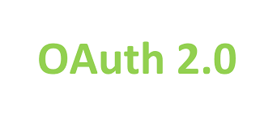
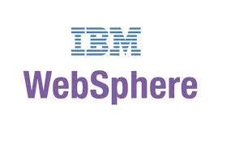

<h1>Hi There, I'm Rahul Srivastava </h1>

I'm a **Microservices Developer** working at [Deloitte](https://www2.deloitte.com/in/en.html). I am responsible for development of Microsrvices API in Java, FAST API implementation and Python Dashboard development using python Dashboarding tool [Dash] (https://plotly.com/dash/) by Plotly. 
Here is my complete resume if you wish to download https://drive.google.com/drive/folders/1EIXAxbMuAAApwoYzyPgvCL6ZnZtkur-t?usp=sharing

## Skill Set :muscle:

These are some of the major technologies that I use or have worked on in the past:

**Programming Languages**

<table style="border: 1px solid black;"> 
<tr> 
<td></td><td></td><td>
</td>
</tr> 
</table>

**Libraries and Frameworks**

<table style="border: 1px solid black;"> 
<tr> 
<td></td><td></td><td></td><td></td><td></td><td></td><td></td><td></td><td></td><td></td>
</tr><tr>
<td></td><td></td>
</tr> </table>

**Cloud**

<table style="border: 1px solid black;"> 
<tr> 
<td></td><td></td><td></td>
<td> </td>
<td> </td>
<td> </td>
</tr> 
</table>

**Databases**

<table style="border: 1px solid black;"> 
<tr> 
<td></td>
<td> </td>
<td> </td>
</tr> 
</table>
 

**Server**

<table style="border: 1px solid black;"> 
<tr> 
<td></td>
<td></td>
<td> </td>
</tr> 
</table>
 

**Tools**

<table style="border: 1px solid black;"> 
<tr> 
<td></td>
<td></td>
<td> </td>
<td> </td>
<td> </td>
</tr> 
</table>
 

 

## Let's Connect :handshake:

### Here is a random meme for you, to make your day better

