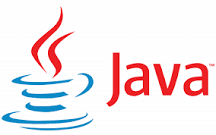

<h1>Hi There, I'm Rahul Srivastava </h1>

I'm a **Microservices Developer** working at [Deloitte](https://www2.deloitte.com/in/en.html). I am responsible for development of Microsrvices API in Java, FAST API implementation and Python Dashboard development using python Dashboarding tool [Dash] (https://plotly.com/dash/) by Plotly.

## Skill Set :muscle:

These are some of the major technologies that I use or have worked on in the past:

**Programming Languages**

||

**Libraries and Frameworks**

<table style="border: 1px solid black;"> <tr> 
<td></td><td></td><td></td><td></td><td></td>
<tr>
<td></td>
</tr>

</tr> </table>

**Cloud**

||||||

**Databases**

|
  

**Server**

||  

**Tools**

||||

 

## Let's Connect :handshake:

### Here is a random meme for you, to make your day better

