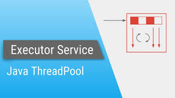
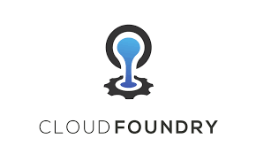

<h1>Hi There, I'm Rahul Srivastava </h1>

I'm a **Microservices Developer** working at [Deloitte](https://www2.deloitte.com/in/en.html). I am responsible for development of Microsrvices API in Java, FAST API implementation and Python Dashboard development using python Dashboarding tool [Dash] (https://plotly.com/dash/) by Plotly.

## Skill Set :muscle:

These are some of the major technologies that I use or have worked on in the past:

**Programming Languages**

||
|--|--|--|

**Libraries and Frameworks**

|||
|--|--|--|--|--|
|||||||

**Cloud**

|||||||

|--|--|

**Databases**

|  |  
|--|--|--|

**Server**

|  |  
|--|--|--|

**Tools**

||||
|--|--|--|--|--|

 

## Let's Connect :handshake:

|
|--|--|

### Here is a random meme for you, to make your day better
(*PS: Refresh the page to see a new meme* :wink: )

